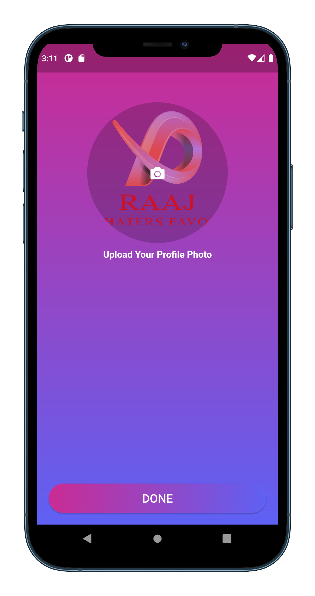

# Tik_Tok_Clone_App

In this video, I'm going to show you how to make a Cool Tik Tok App a new Instagram using Flutter,firebase and visual studio code.

In this tutorial, you will learn how to Upload a Profile Pic to Firestore Data Storage.

🚀 Nice, clean and modern TikTok Clone #App #UI made in #Flutter⚠️ 
## [Watch it on YouTube](https://youtu.be/F_GgZVD4sDk)

   
**Packages we are using:**

-   cupertino_icons: [link](https://pub.dev/packages/cupertino_icons)
-   firebase_core: [link](https://pub.dev/packages/firebase_core)
-   cloud_firestore: [link](https://pub.dev/packages/cloud_firestore)
-   firebase_auth: [link](https://pub.dev/packages/firebase_auth)
-   provider: [link](https://pub.dev/packages/provider)
-   hexcolor: [link](https://pub.dev/packages/hexcolor)
-   flutter_svg: [link](https://pub.dev/packages/flutter_svg)
-   firebase_storage: [link](https://pub.dev/packages/firebase_storage)
-   fluttertoast: [link](https://pub.dev/packages/fluttertoast)

## Screens it contains:

=> Login Screen

=> SignUp Screen

Now it contains all the screen, thanks for your love and support 🙏

## Photos

